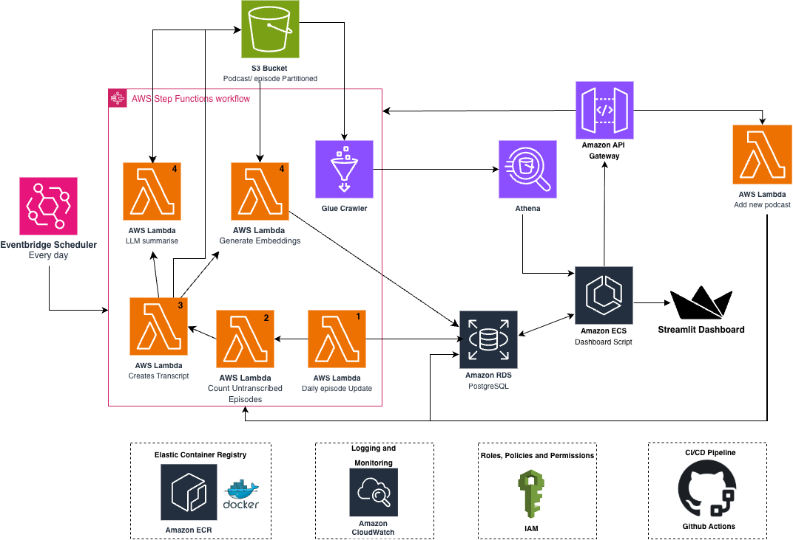
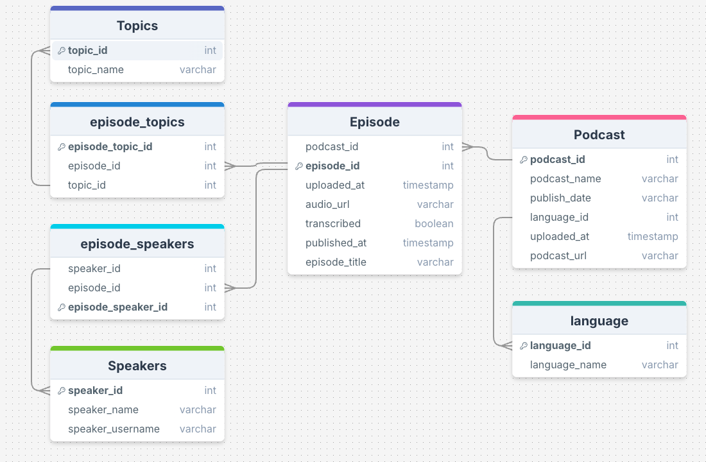

# QuadCast AI

QuadCast is an AI-powered podcast analytics platform that helps you discover insights from your favorite podcasts. Simply add a podcast RSS feed, and QuadCast automatically transcribes episodes with speaker identification, generates summaries, and provides a dashboard to explore the content.

## Team

* Lorenzo - @Lorenzo-O114 - Project Manager
* Mikey - @michaeljosephwatson - Architect & DevOps
* Helena - @helenacalvert - QA Tester
* Zuhayr - @zu56789 - Business Analyst

Additionally, everyone had the additional role of Engineer & Analyst.

## What It Does

- **Subscribe to Podcasts**: Add any podcast via its RSS feed
- **Automatic Transcription**: Episodes are transcribed using AI with speaker diarization (who said what)
- **Smart Summaries**: Get AI-generated summaries of episodes (coming soon)
- **Analytics Dashboard**: View and search your podcast library with detailed episode information

## How It Works

QuadCast runs on AWS and processes podcasts automatically:

1. You add a podcast RSS feed through the API
2. The system checks for new episodes daily
3. Episodes are transcribed with speaker labels using OpenAI's GPT-4o
4. Transcripts are stored and indexed
5. You can view everything through the web dashboard

## Architecture



## Database Design



## Tech Stack

- **Backend**: AWS Lambda (Python), RDS PostgreSQL
- **AI**: OpenAI gpt-4o-transcribe-diarize for transcription and diarization
- **Storage**: AWS S3 for transcripts
- **Frontend**: Streamlit dashboard
- **Infrastructure**: Terraform

## Getting Started

### Prerequisites

- Python 3.9+
- AWS Account
- OpenAI API Key

### Local Development

1. Clone the repository
2. Create a virtual environment:
   ```bash
   python3 -m venv .venv
   source .venv/bin/activate
   ```
3. Install dependencies:
   ```bash
   pip install -r requirements.txt
   ```
4. Set up environment variables in `.env`:
   ```
   RDS_HOST=your-database-host
   RDS_DB_NAME=your-database-name
   RDS_USERNAME=your-username
   RDS_PASSWORD=your-password
   OPENAI_API_KEY=your-openai-key
   ```
5. Run the dashboard:
   ```bash
   cd dashboard
   streamlit run app.py
   ```

### Running Tests

```bash
source .venv/bin/activate
pytest
```

### Deploying Infrastructure

```bash
cd terraform
terraform init
terraform plan
terraform apply
```

## Project Structure

- `add_podcast/` - Lambda function to add new podcasts
- `transcribe/` - Lambda function to transcribe episodes
- `llm_summarise/` - Lambda function to generate summaries (coming soon)
- `daily_pipeline/` - Scheduled job to check for new episodes
- `dashboard/` - Streamlit web interface
- `terraform/` - Infrastructure as code
- `db_schema/` - Database schema

